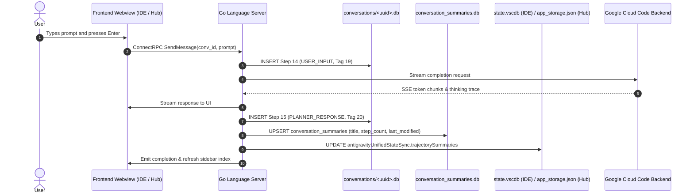

# Data Flow Lifecycle: Message Creation to Storage

```mermaid
sequenceDiagram
    autonumber
    actor User
    participant Frontend as Frontend Webview (IDE / Hub)
    participant LS as Go Language Server
    participant SQLite as conversations/<uuid>.db
    participant MasterDB as conversation_summaries.db
    participant VSCDB as state.vscdb (IDE) / app_storage.json (Hub)
    participant Cloud as Google Cloud Code Backend

    User->>Frontend: Types prompt and presses Enter
    Frontend->>LS: ConnectRPC SendMessage(conv_id, prompt)
    LS->>SQLite: INSERT Step 14 (USER_INPUT, Tag 19)
    LS->>Cloud: Stream completion request
    Cloud-->>LS: SSE token chunks & thinking trace
    LS->>Frontend: Stream response to UI
    LS->>SQLite: INSERT Step 15 (PLANNER_RESPONSE, Tag 20)
    LS->>MasterDB: UPSERT conversation_summaries (title, step_count, last_modified)
    LS->>VSCDB: UPDATE antigravityUnifiedStateSync.trajectorySummaries
    LS->>Frontend: Emit completion & refresh sidebar index
```

---
