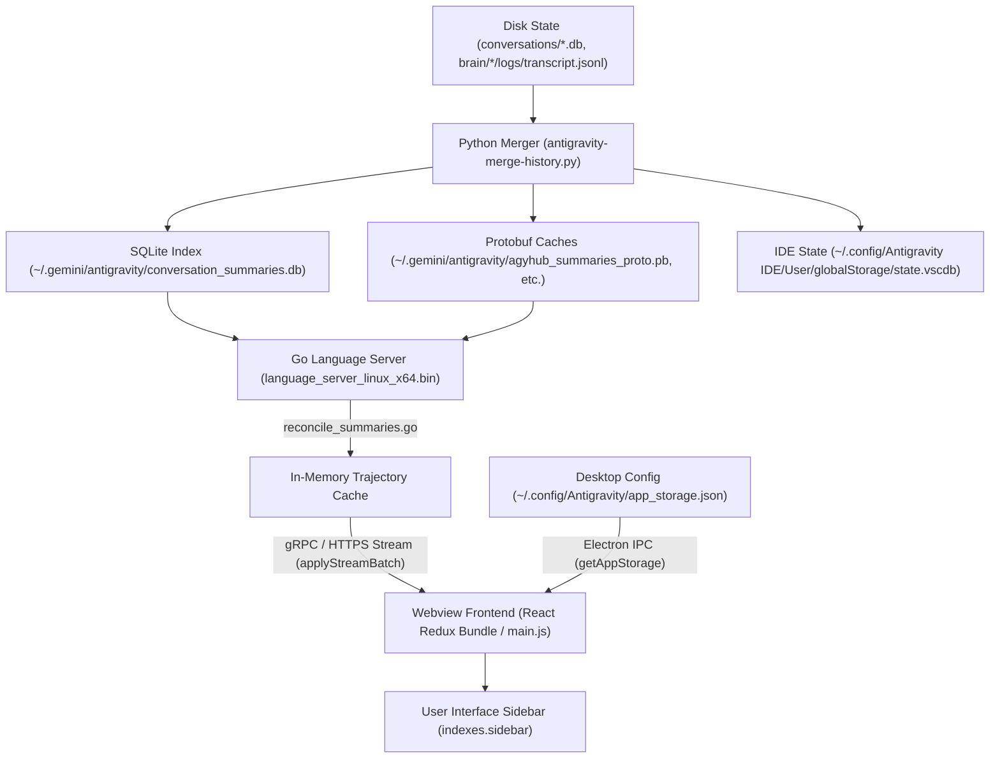

# Architectural Overview & Telemetry Chain

```mermaid
graph TD
    A["Disk State (conversations/*.db, brain/*/logs/transcript.jsonl)"] --> B["Python Merger (antigravity-merge-history.py)"]
    B --> C["SQLite Index (~/.gemini/antigravity/conversation_summaries.db)"]
    B --> D["Protobuf Caches (~/.gemini/antigravity/agyhub_summaries_proto.pb, etc.)"]
    B --> E["IDE State (~/.config/Antigravity IDE/User/globalStorage/state.vscdb)"]
    C & D --> F["Go Language Server (language_server_linux_x64.bin)"]
    F -- "reconcile_summaries.go" --> G["In-Memory Trajectory Cache"]
    G -- "gRPC / HTTPS Stream (applyStreamBatch)" --> H["Webview Frontend (React Redux Bundle / main.js)"]
    I["Desktop Config (~/.config/Antigravity/app_storage.json)"] -- "Electron IPC (getAppStorage)" --> H
    H --> J["User Interface Sidebar (indexes.sidebar)"]
```

---
